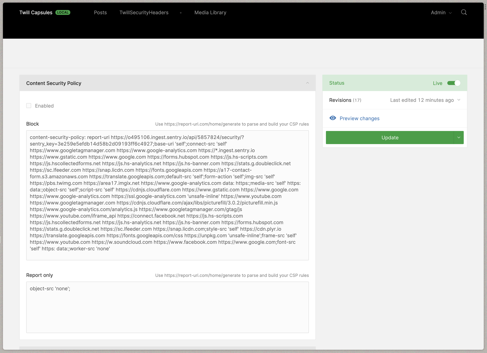
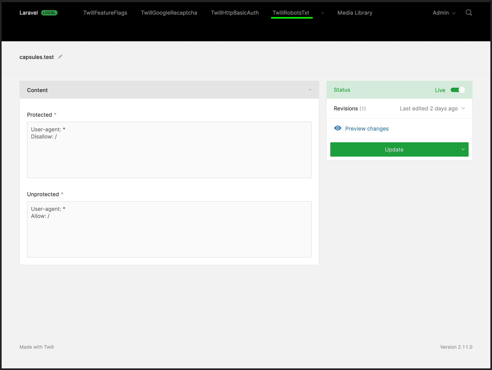
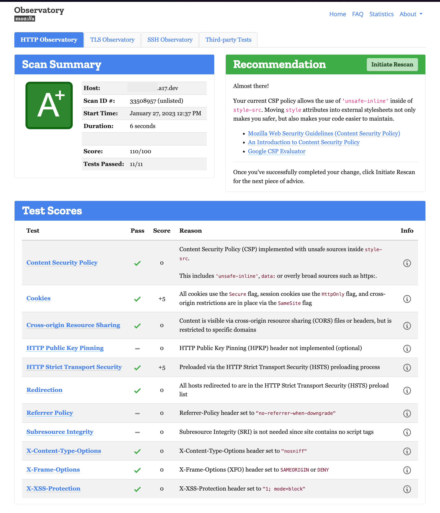

# Security Headers Twill Capsule

This Twill Capsule is intended to enable developers add Security Headers configuration to applications, giving users a friendly dashboard to configure these headers: 

## Screenshots

### CMS configuration




### [Mozilla Observatory](https://observatory.mozilla.org) security headers check



## Supported Headers

- [CSP (Content Security Policy)](https://developer.mozilla.org/en-US/docs/Web/HTTP/CSP)
- [HSTS (Strict-Transport-Security)](https://developer.mozilla.org/en-US/docs/Web/HTTP/Headers/Strict-Transport-Security)
- [Permissions-Policy](https://developer.mozilla.org/en-US/docs/Web/HTTP/Headers/Permissions-Policy)
- [Referrer-Policy](https://developer.mozilla.org/en-US/docs/Web/HTTP/Headers/Referrer-Policy)
- [X-Content-Type-Options](https://developer.mozilla.org/en-US/docs/Web/HTTP/Headers/X-Content-Type-Options)
- [X-Frame-Options](https://developer.mozilla.org/en-US/docs/Web/HTTP/Headers/X-Frame-Options)
- [Expect-CT](https://developer.mozilla.org/en-US/docs/Web/HTTP/Headers/Expect-CT) (deprecated by most browsers)
- [X-XSS-Protection](https://developer.mozilla.org/en-US/docs/Web/HTTP/Headers/X-XSS-Protection) (non-standard, not for production)

## Unwanted headers
This capsule also has an option for removing any unwanted headers from the response. Update the `config/twill-security-headers.php` file to add any unwanted headers from the response: 

```php
'unwanted-headers' => ['X-Powered-By', 'server', 'Server'],
```

## Installing

## Supported Versions
Composer will manage this automatically for you, but these are the supported versions between Twill and this package.

| Twill Version | HTTP Basic Auth Capsule |
|---------------|-------------------------|
| 3.x           | 2.x                     |
| 2.x           | 1.x                     |

### Require the Composer package:

``` bash
composer require area17/twill-security-headers
```

### Publish the configuration

``` bash
php artisan vendor:publish --provider="A17\TwillSecurityHeaders\ServiceProvider"
```

### CSP config
Creating CSP policies usually takes time and it's hard to write them manually. You can make use if [Report URI](https://report-uri.com/home/generate), a great tool that allows you to paste your current policy, edit and generate a new string to be pasted on the package.  

## Disabling

This package is enabled and injects itself automatically. To disable it you just need to add to `.env`:

```dotenv
TWILL_SECURITY_HEADERS_ENABLED=false
```

## Contribute

Please contribute to this project by submitting pull requests.
