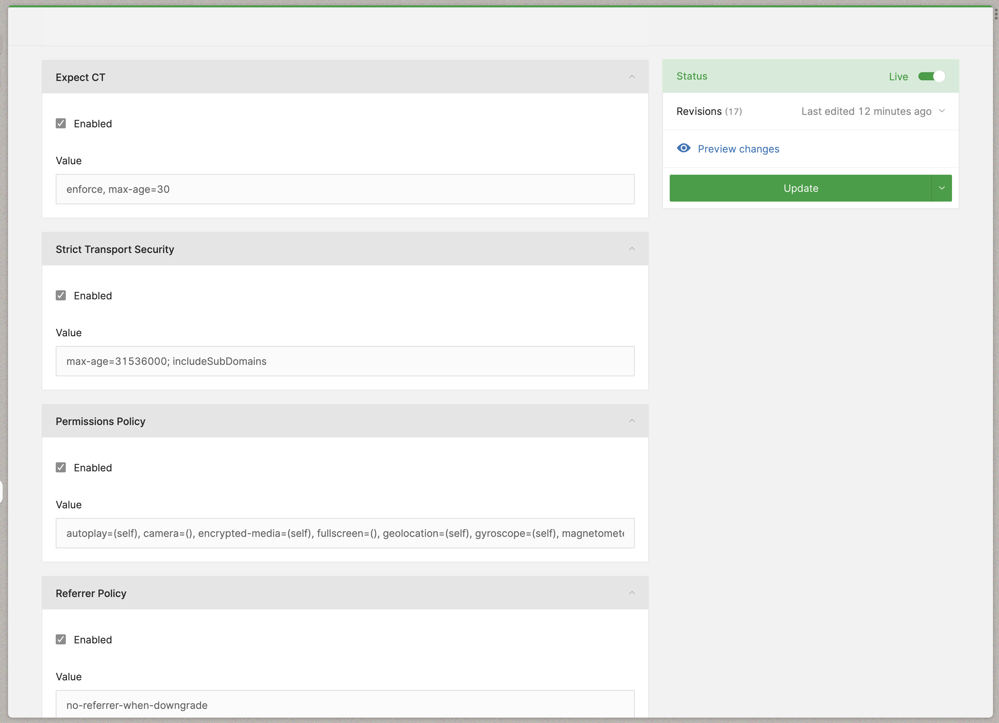

# Security Headers Twill Capsule

This Twill Capsule is intended to enable developers add Security Headers configuration to applications, giving users a friendly dashboard to configure these headers: 




## Supported Headers

- [CSP (Content Security Policy)](https://developer.mozilla.org/en-US/docs/Web/HTTP/CSP)
- [HSTS (Strict-Transport-Security)](https://developer.mozilla.org/en-US/docs/Web/HTTP/Headers/Strict-Transport-Security)
- [Permissions-Policy](https://developer.mozilla.org/en-US/docs/Web/HTTP/Headers/Permissions-Policy)
- [Referrer-Policy](https://developer.mozilla.org/en-US/docs/Web/HTTP/Headers/Referrer-Policy)
- [X-Content-Type-Options](https://developer.mozilla.org/en-US/docs/Web/HTTP/Headers/X-Content-Type-Options)
- [X-Frame-Options](https://developer.mozilla.org/en-US/docs/Web/HTTP/Headers/X-Frame-Options)
- [Expect-CT](https://developer.mozilla.org/en-US/docs/Web/HTTP/Headers/Expect-CT) (deprecated by most browsers)
- [X-XSS-Protection](https://developer.mozilla.org/en-US/docs/Web/HTTP/Headers/X-XSS-Protection) (non-standard, not for production)

This capsule also adds an option for removing any unwanted headers from the response. 

## Installing

### Require the Composer package:

``` bash
composer require area17/twill-security-headers
```

### Publish the configuration

``` bash
php artisan vendor:publish --provider="A17\TwillSecurityHeaders\ServiceProvider"
```

## Contribute

Please contribute to this project by submitting pull requests.
